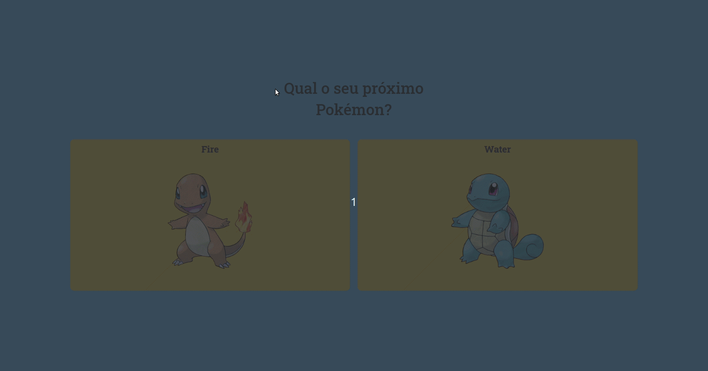
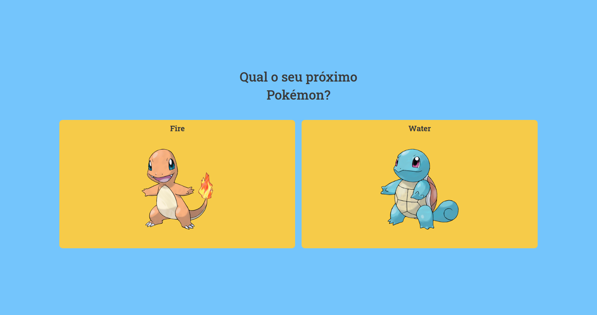
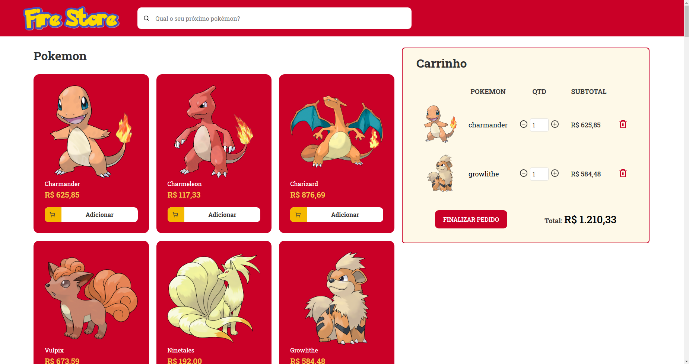
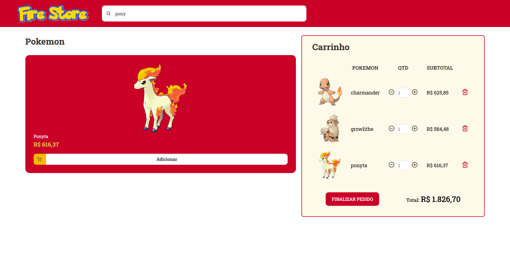
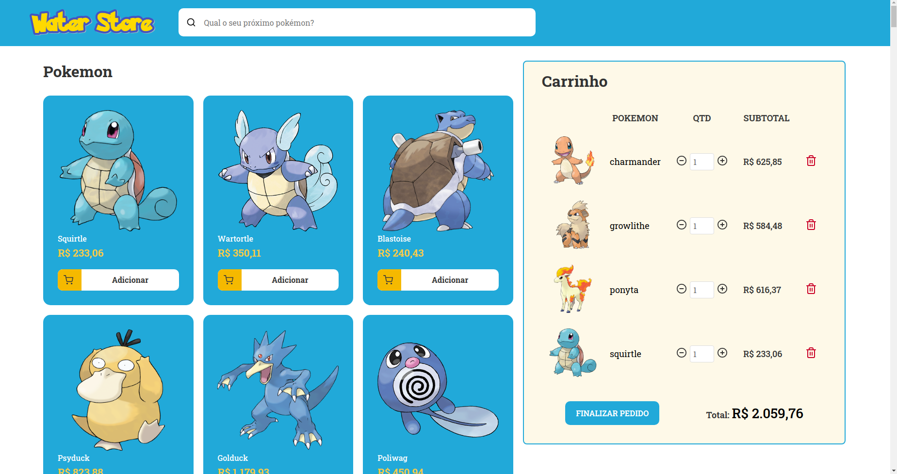
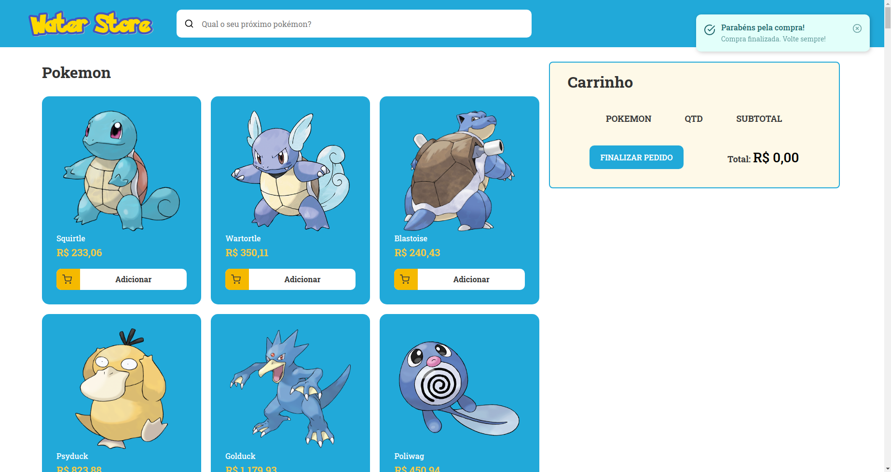

<p align=center>
  
</p>

<p align="center">
  

  

  <a href="https://www.linkedin.com/in/luisafcorrea/">
    
  </a>
</p>

<br>
<br>
<br>

#  Sobre

Projeto desenvolvido para o processo seletivo da <a href="https://ri.b2w.digital/">B2W Digital</a>.
<br>
O desafio teve o objetivo de propor a experência de construir uma loja virtual de pokémon, já que a empresa é holding de 4 lojas virtuais e marketplaces.

<br>

#  Desafio

O desafio consistem em fazer a integração com a api <a href="https://pokeapi.co/">pokeapi</a> para exibir os pokémons e separa-los por loja.
<br>
<br>
Ex: Loja fogo possui pokémons de fogo.
<br>
<br>
Além disso, deve ser possível adicionar e retirar pokémons em um carrinho e mostrar o valor total da compra.
<br>
<br>
O valor de cada pokémon é definido aleatoriamente.
<br>
<br>

#  Funcionalidades

- [x] Catálogo de produtos(pokémon)
- [x] Carrinho lateral
- [x] Resumo do carrinho
- [x] 2 lojas com estilos e tipos diferentes de Pokémon (Fogo  e água )
- [x] Barra de busca
- [x] Botão de finalizar compra reiniciando o processo de compra
- [x] Modal de obrigado ao finalizar compra
- [x] Salvar os dados da compra do usuário localmente para não perdê-los ao atualizar a página

<br>
<br>

#  Tecnologias utilizadas

- [x] ReactJS
- [x] TypeScript
- [x] React Router
- [x] Context API
- [x] Styled Components
- [x] Axios
- [x] React icons
- [x] Polished

<br>
<br>

#  Imagens

<h3><strong>Gif</strong></h3>

<br>
<h3><strong>Home</strong></h3>

<br>
<h3><strong>Loja Fogo</strong></h3>

<br>
<h3><strong>Buscar</strong></h3>

<br>
<h3><strong>Loja Agua</strong></h3>

<br>
<h3><strong>Toast Compra efeutada</strong></h3>


<br>
<br>

#  Como usar

Para rodar o proejto localmente na sua máquina instale o <a href="https://git-scm.com/">Git</a> e o <a href="https://nodejs.org/en/">NodeJS</a>. E realize os seguintes passos:

```shell
# Clone o repositorio
$ git clone https://github.com/LuisaFC/pokestore.git
# Enter na pasta do projeto
$ cd pokestore

# Instale as dependências
$ yarn

# Inicie o projetp
$ yarn start
```

Depois de realizar os passos, o projeto poderá ser acessado em `http://localhost:3000`.
